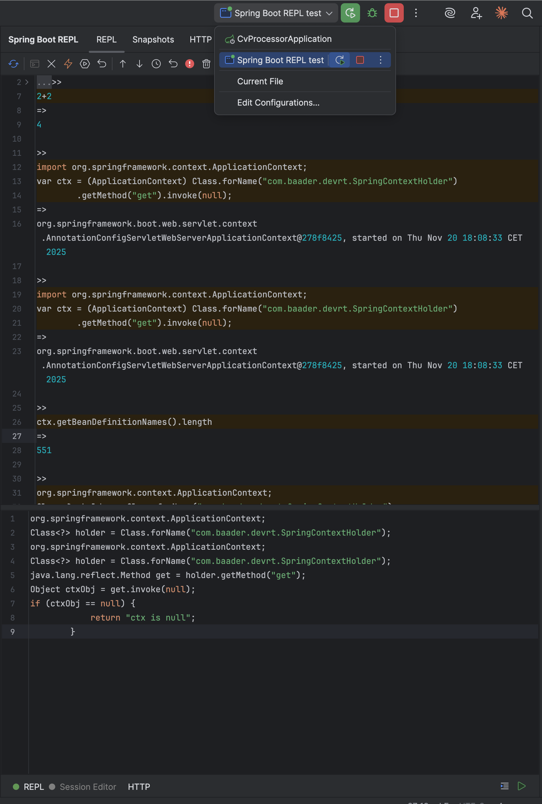
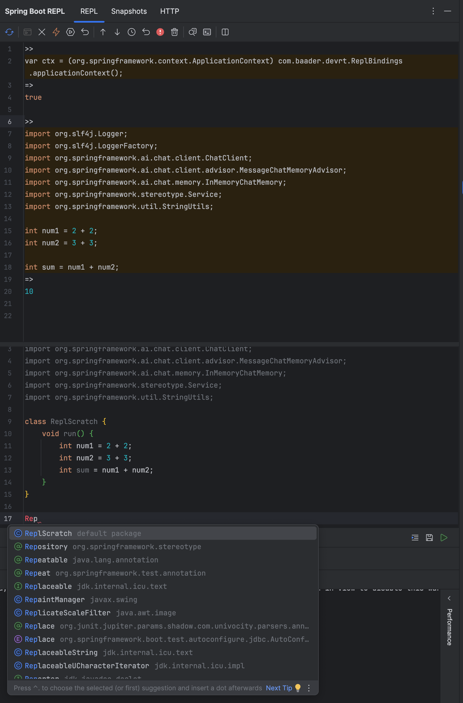
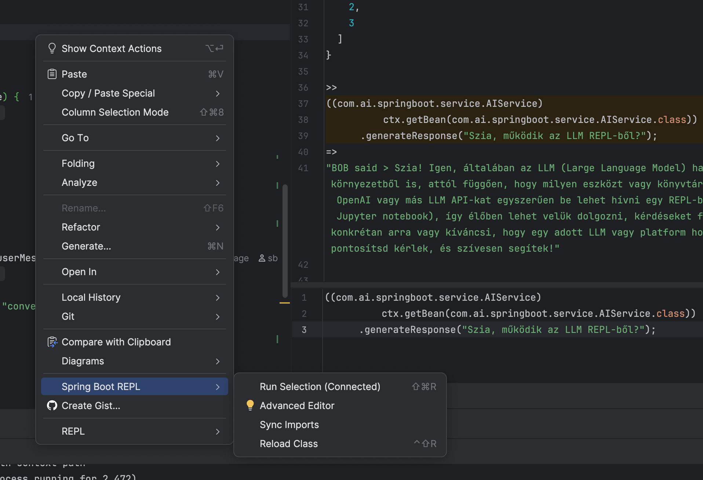
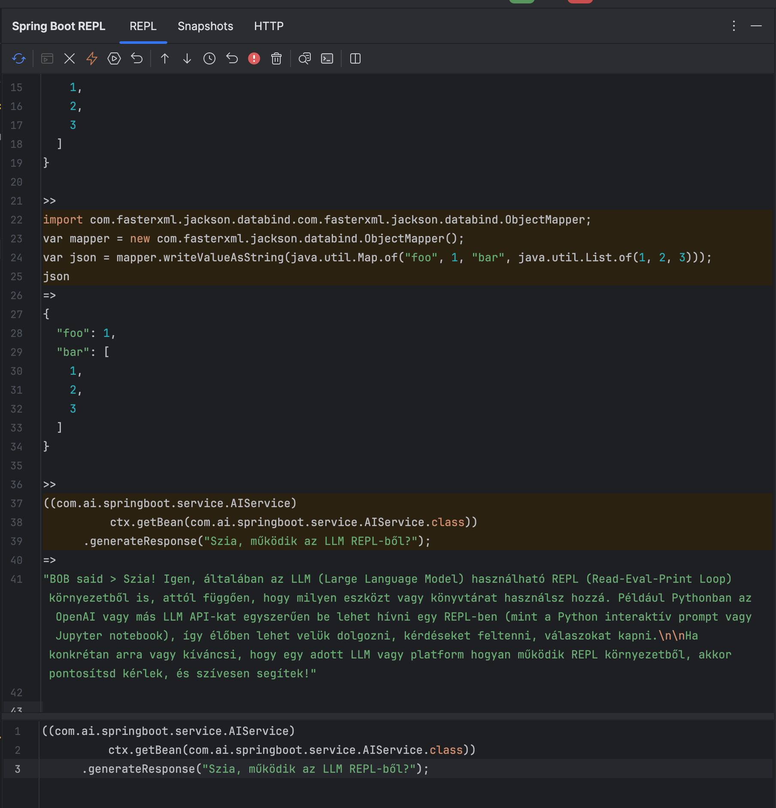

# Spring Boot REPL — IntelliJ IDEA Plugin


For years, Java developers have envied the immediate feedback loop of dynamic languages like Python or Clojure. We've dealt with "restart hell," complex configurations, and slow debugging cycles just to test a single method. "That ends today". 

This plugin brings the true power of REPL-Driven Development to the Spring Boot ecosystem, with zero friction. Started as a fun side project, but it turned into a tool I use daily. It's currently in alpha, but ready for you to tinker with. 

Make the magic happen, share with me your feedback!

****WHAT is this?****

***Spring Boot REPL is an IntelliJ IDEA plugin that lets you evaluate Java code over nREPL against a live Spring Boot JVM, with JShell-like or JavaCodeEvaluator-like evaluation, Snapshots-Variables, Spring context binding, HotSwap and HTTP helpers.***


- **Powered by Java Attach API**: Utilizing the same advanced technology as industry-standard tools (like JRebel or JProfiler), the plugin dynamically injects itself into your running JVM without requiring a restart.
- **Live Context Access**: You aren't running in a sandbox. You have full access to your live Spring Context, active Beans, and database connections.

    Example: Just type userService.findAllByStatus("ACTIVE") and interact with your real data immediately.


****RELEASES****

v0.8.0 is a **major** release which support Spring Boot REPL run configs (without extra dependencies and configurations).



v0.7.5 this version used plugin + dependencies and extra configs








v0.5.0 - initial version


## Modules
- `src/` – IntelliJ plugin (tool window UI, nREPL client, REPL editor, transcript, HTTP panel, snapshots, history).
- `dev-runtime/` – attachable JVM agent that exposes a JShell-based REPL and Spring context auto-bind.
- `sb-repl-bridge/` – optional Spring-side bridge library (shared `SpringContextHolder`) for advanced / remote setups.
- `sb-repl-agent/` – Maven-packaged dev-runtime agent, for manual integration outside IntelliJ.
- `spring-boot-integration/` – example Spring Boot app with embedded nREPL server and Java evaluator.
- `docs/`, `SPRING_REPL_HELP.md` – additional usage notes and examples.

## Spring Boot integration (0.8.0, zero-config)

For local development with IntelliJ IDEA you do **not** need to add any dependencies or code to your Spring Boot app.

1. Install the plugin ZIP in IntelliJ IDEA (see below).
2. Create a **Run Configuration** of type **Spring Boot REPL** and set its main class to your Spring Boot application.
3. Run this configuration:
   - the bundled dev-runtime agent,
   - the agent starts an in-process nREPL server,
   - the Spring `ApplicationContext` is captured via `SpringApplication.run(...)` and auto-bound.
4. Open the **Spring Boot REPL** tool window:
   - the plugin auto-connects to the dev-runtime nREPL (or you can click **Connect** once),
   - the Spring context is bound and a `ctx` variable is initialized in the jREPL (like JShell) and jEval (like real JavaCodeEvaluator) session.


The `sb-repl-bridge` and `sb-repl-agent` modules v0.8.0 remain available if you:

- run the dev-runtime agent manually (outside IntelliJ),
- want to share `SpringContextHolder` between the agent and the app in non-standard setups,
- or integrate with other tools that expect these artifacts from Maven Central.


## Plugin configuration

Open `Settings → Tools → Spring Boot REPL` and configure:

- **Host**: usually `127.0.0.1`
- **Port**: nREPL port (should match the agent port; default `5557`)
- **Agent port**: port where the dev-runtime agent listens (used by the Spring Boot REPL Run Configuration).
- **Agent JAR (optional)**:
  - leave empty to use the agent bundled into the plugin, or
  - point to a custom dev-runtime JAR if you need a different version / remote setup.

Then:

1. Run your Spring Boot application via the **Spring Boot REPL** run configuration (bundled agent auto-attached).
2. Open the **Spring Boot REPL** tool window.
3. The plugin auto-connects and binds the Spring context; the `ctx` variable is ready in JREPL. A manual **Connect** / **Bind Spring Context** is only needed as a fallback.

When JREPL mode is active you will see:

- `Mode: JREPL session (stateful imports & defs)`
- Spring context binding messages in the log.

## REPL workflow – quick examples

Bind the Spring context and call a service:

```java
import com.baader.devrt.SpringContextHolder;
import org.springframework.context.ApplicationContext;

ApplicationContext ctx = (ApplicationContext) SpringContextHolder.get();
var ai = (com.ai.springboot.service.AIService)
        ctx.getBean(com.ai.springboot.service.AIService.class);
ai.generateResponse("Hello from Spring Boot REPL");
```

Create a logger from the REPL:

```java
import org.slf4j.Logger;
import org.slf4j.LoggerFactory;
Logger logger = LoggerFactory.getLogger("REPL");
logger.info("AI service is available");
```

HotSwap a modified class:

1. Open the Java file in the editor and select the full class (or leave nothing selected to use the whole file).
2. In the **Spring Boot REPL** tool window, click **Hot Swap**.
3. The next REPL call uses the reloaded implementation.

### REPL UI and editor actions

- **REPL tab** – bottom Java editor (stateful JShell), top transcript with collapsible code/result blocks.
- **Last Result** popup – pretty-printed value of the last evaluation (JSON-aware, syntax-highlighted).
- **Log** popup – full console output (out/err, nREPL protocol messages).
- **Editor actions** (from SB Tools / context menu):
  - Run Selection in Spring Boot REPL
  - Evaluate at Caret
  - Reload Class (HotSwap)
  - Sync Imports and apply import aliases
  - Insert Bean Getter (searchable Spring bean picker).
