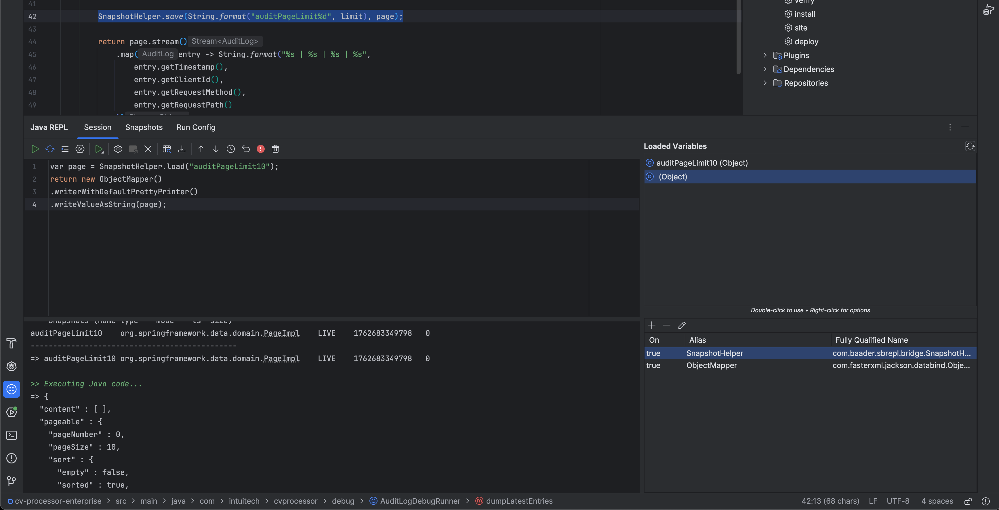

# Spring Boot REPL – Usage Guide

This guide explains how to use the **Spring Boot REPL** IntelliJ plugin with a running Spring Boot application, and how the REPL transcript, snapshots and helpers fit together.





---

## 1. Quick Start

### 1.1 Start your Spring Boot application

Run your app with the dev-runtime agent attached (see `README.md` for full details), for example:

```bash
./gradlew :dev-runtime:jar
java \
  -javaagent:/path/to/dev-runtime/build/libs/dev-runtime-agent-0.7.2.jar=port=5557 \
  -jar your-app.jar
```

You should see in the application logs that the agent started and the nREPL server is listening on the configured port (default: `5557`).

### 1.2 Start IntelliJ IDEA with the plugin

- Either run the sandbox IDE from this repo:

```bash
./gradlew runIde
```

- Or install the built plugin ZIP (`sb-repl-0.7.2.zip`) into your main IDE.

Then open the **Spring Boot REPL** tool window.

### 1.3 Configure and connect

In IntelliJ:

1. Open `Settings → Tools → Spring Boot REPL`.
2. Set **Host** to `127.0.0.1` and **Port** to the nREPL port (e.g. `5557`).
3. Optionally set an **Agent JAR** path if it is not resolved from Maven.
4. Apply settings.

In the Spring Boot REPL tool window:

1. Click **Connect** to connect to the running nREPL / dev-runtime agent.
2. Once connected, click **Bind Spring Context** if your setup requires explicit binding.
3. The log should show that JShell mode is active and the Spring context is bound.

---

## 2. REPL UI and Transcript

The **REPL** tab has two main areas:

- **Bottom** – Java editor (JShell-backed):
  - Write Java snippets here.
  - Run with **Execute** (button) or **Ctrl+Enter**.
  - Stateful: imports, variables and definitions are kept across evaluations.

- **Top** – Transcript (read-only):
  - Every evaluation becomes a block:
    - `>>` – the code that was executed (input snippet).
    - `=>` – the formatted result (value or error).
  - Blocks are foldable; the most recent ones stay expanded.
  - Input snippet has a subtle background so it stands out from the result.

Additional helpers:

- **Last Result** popup – shows the last returned value in a dedicated read-only editor:
  - JSON is pretty-printed and syntax-highlighted when possible.
  - Long responses are wrapped for readability.
- **Log** popup – shows the full console (out/err, JShell/nREPL messages, errors).

Evaluations reach the transcript in two ways:

- From the REPL editor (**Execute / Ctrl+Enter**).
- From a Java file via **Evaluate at Caret** (SB Tools / context menu).

Both modes send the snippet through the same path, so every evaluation appears as a block in the transcript.

---

## 3. Working with Spring Beans

The recommended pattern is:

1. Expose the Spring `ApplicationContext` to the agent via the bridge (`sb-repl-bridge` + `SpringContextHolder`), as described in `README.md`.
2. From the REPL, obtain the context and call your beans.

Example:

```java
import com.baader.devrt.SpringContextHolder;
import org.springframework.context.ApplicationContext;

ApplicationContext ctx = (ApplicationContext) SpringContextHolder.get();
var service = ctx.getBean("bloodPressureService");
```

### 3.1 Using reflection (safe with DevTools)

Reflection works even if Spring Boot DevTools or multiple classloaders are in play:

```java
var service = ctx.getBean("bloodPressureService");
return service.getClass().getMethod("getStatistics").invoke(service);
```

With parameters:

```java
var service = ctx.getBean("bloodPressureService");
var method = service.getClass().getMethod("getRecentReadings", int.class);
return method.invoke(service, 10);
```

### 3.2 Direct casts (when DevTools is disabled)

If DevTools is not on the classpath and you share the same classloader:

```java
var service = (hu.vernyomas.app.service.BloodPressureService)
        ctx.getBean("bloodPressureService");
return service.getStatistics();
```

Or with typed `getBean`:

```java
var service = ctx.getBean(
        "bloodPressureService",
        hu.vernyomas.app.service.BloodPressureService.class
);
return service.getStatistics();
```

### 3.3 Insert Bean Getter helper

The **Insert Bean Getter** action in the REPL toolbar:

- Fetches the list of Spring beans from the running app.
- Shows a searchable popup (by bean name and type).
- Inserts a snippet like:

```java
var myService = ctx.getBean(FooService.class);
```

The action is only enabled when the Spring context is bound.

---

## 4. Snapshots

The **Snapshots** tab lets you persist and reload values from the REPL.

### 4.1 Saving a snapshot

1. Run some code in the REPL that produces a value.
2. Switch to **Snapshots**.
3. Click **Save**, choose a name (e.g. `stats1`).

### 4.2 Loading a snapshot back into the REPL

1. In **Snapshots**, select the entry and click **Load**.
2. A Java snippet is inserted into the REPL editor, typically using `SnapshotStore`:

```java
Object stats1;
try {
  Class<?> ss = Class.forName("com.baader.devrt.SnapshotStore");
  java.lang.reflect.Method get = ss.getMethod("get", String.class);
  stats1 = get.invoke(null, "stats1");
} catch (Exception e) {
  stats1 = null;
  System.err.println("Failed to load: " + e);
}
return stats1;
```

You can then edit or extend this snippet before running it.

### 4.3 Importing JSON

1. Click **Import JSON** in the Snapshots tab.
2. Paste a JSON document.
3. Provide a target type, for example:

```text
hu.vernyomas.app.entity.BloodPressureReading
```

4. Choose a snapshot name.

---

## 5. HotSwap – reloading modified classes

HotSwap lets you recompile and reload classes into the running Spring Boot JVM.

1. Open a Java class in the editor (e.g. `AIService`).
2. Select the whole class or leave the selection empty to use the entire file.
3. In the **Spring Boot REPL** tool window, click **Hot Swap**.

The dev-runtime agent compiles the source and calls `Instrumentation.redefineClasses` to reload it. Only classes that are already loaded by the JVM can be redefined; if you see “class not loaded”, exercise the old code once and then try HotSwap again.

---

## 6. Debugging Tips

### 6.1 `cannot find symbol`

- Make sure you imported the required types or used fully-qualified names.
- When working with beans:

```java
return ctx.containsBean("bloodPressureService");
```

### 6.2 Spring context not bound

- Check that the app is running with the dev-runtime agent.
- Verify host/port in `Settings → Tools → Spring Boot REPL`.
- Use **Bind Spring Context** and check the log for success messages.

### 6.3 nREPL / connection issues

- Ensure the nREPL port is open and not used by another process.
- Try reconnecting from the tool window (Disconnect → Connect).

---

## 7. Best Practices

1. Prefer reflection when you are unsure about classloader boundaries.
2. Use fully-qualified class names the first time; then add imports.
3. Use the transcript to keep a history of what was executed and what it returned.
4. Save snapshots for expensive or hard-to-reproduce values.
5. Keep Spring Boot REPL bound to localhost only, and use it in development environments. 
